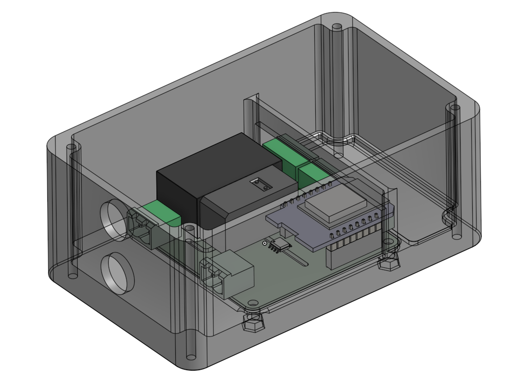

## Case for the power-monitoring PCB

The source files for the case are [here](https://cad.onshape.com/documents/f34608c3b50537d27d2a70f4/w/dc4bf4f182cd748e33a69883/e/08b9ab1bdb92c4a2750b073b).

It's made on OnShape. To do anything but view you'll need a free account. For that reason step and stl files for the case have been provided here as well, in a folder of their own.

