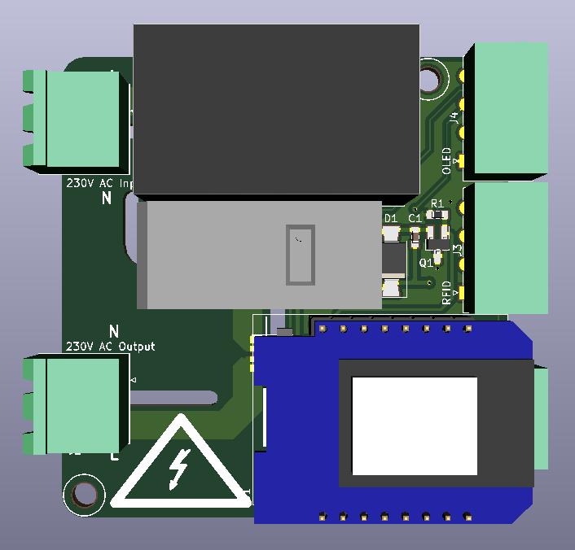
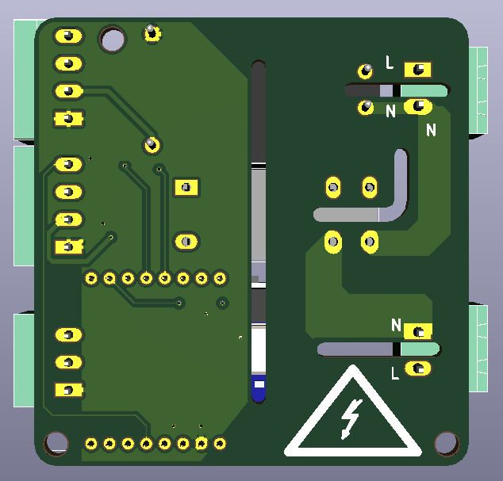

# Power monitoring acces system

A module based on AndersV209s work on the Wemos D1 Mini based boards.
Main changes are:

- DPST relay that breaks both Live and Neutral and handles 8A
- ACS723 10A current monitoring chip

The changes have been done to support use on 3D printers, or other machines where the user won't be expected to leave their key FOB in the device, and where the board can then determine end of use when power draw drops significantly 

